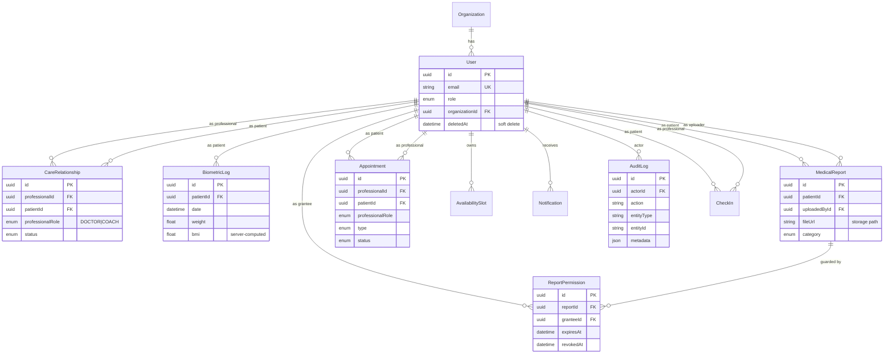

# Salute di Ferro — Health Service Platform

Next.js 16 + Prisma 7 + Supabase backend for a multi-role health service
(patient ↔ doctor ↔ coach) with biometric tracking, medical records with
granular per-user permissions, appointments with availability
management, and an audit trail.

## Health Service Architecture

### Roles and permissions

| Role | Canonical home | Can do |
| ---- | -------------- | ------ |
| `ADMIN` | `/dashboard/admin` | Everything. Provisions DOCTOR/COACH via `/dashboard/admin/users/new`. |
| `DOCTOR` | `/dashboard/doctor` | Manage assigned patients, read biometrics and reports (when permission is granted), manage own calendar and availability. Upload reports on behalf of patients. |
| `COACH` | `/dashboard/coach` | Read assigned patients' biometrics and reports (when permission is granted), manage own calendar and availability. |
| `PATIENT` | `/dashboard/patient` | Own profile, own biometric logs, own medical records, own appointments. Controls per-report permissions for DOCTOR/COACH. |

Every write endpoint runs a double check: the caller must have an
`ACTIVE` `CareRelationship` with the patient **and**, for read access
to medical reports, an unrevoked and unexpired `ReportPermission` on
the specific document.

The middleware (`middleware.ts`) enforces role-based route segmentation
via the `ROLE_HOME` + `ROLE_RULES` tables. Dev bypass (`NODE_ENV=
development` + `NEXT_PUBLIC_DEV_BYPASS=1`) lets you impersonate any
role via `?role=doctor|coach|patient|admin` on any `/dashboard/*` URL.

### Main flows

1. **Patient onboarding** — public registration at `/register` creates
   a Supabase auth user + Prisma `User` row (`role=PATIENT`).
2. **Professional provisioning** — only an `ADMIN` can create a
   `DOCTOR` or `COACH` via `/dashboard/admin/users/new`.
3. **Care relationship** — admin (or seed) creates a `CareRelationship`
   row linking a professional to a patient with `professionalRole ∈
   {DOCTOR, COACH}`. The compound unique is
   `(professionalId, patientId, professionalRole)`.
4. **Biometric logging** — patient POSTs to `/api/biometrics` via the
   6-tab editor at `/dashboard/patient/health`. BMI is computed
   server-side from `weight + heightCm`.
5. **Medical records** — patient uploads PDFs/images to the **private**
   `medical-reports` Supabase bucket (20MB cap, mime guard). They grant
   access per-report via `POST /api/medical-reports/[id]/permissions`.
   Readers fetch a fresh 15-minute signed URL from
   `GET /api/medical-reports/[id]`.
6. **Appointments** — patient books a slot via
   `/dashboard/patient/appointments` (slot picker backed by
   `/api/availability?slots=1`). Server runs a conflict check on the
   target professional and writes paired `Notification` rows.
7. **Availability** — professionals manage recurring (by dayOfWeek)
   and one-off slots via `/dashboard/{doctor,coach}/availability`.
8. **Audit** — every sensitive action (login, profile/avatar update,
   medical-report upload/view/permission change, registration)
   appends a row to `AuditLog` with actor id, IP, user agent, and
   JSON metadata.
9. **GDPR export / delete** — `GET /api/me/export` returns a full JSON
   dump of the caller's data; `DELETE /api/me` soft-deletes the user
   (30-day grace), revokes all outgoing `ReportPermission` rows,
   archives all `CareRelationship` rows, and removes the caller's
   files from the private bucket.

### Schema (high-level)



Full schema in `prisma/schema.prisma`. Enums: `UserRole =
[ADMIN, DOCTOR, COACH, PATIENT]`; `ProfessionalRole = [DOCTOR, COACH]`;
`MedicalReportCategory = [BLOOD_TEST, IMAGING, CARDIOLOGY,
ENDOCRINOLOGY, GENERAL_VISIT, PRESCRIPTION, VACCINATION, SURGERY,
OTHER]`; `AppointmentType = [IN_PERSON, VIDEO_CALL, VISIT, FOLLOW_UP,
COACHING_SESSION]`.

## Environment variables

Copy `.env.local.example` (or create one) with:

```bash
# Supabase (both browser and server)
NEXT_PUBLIC_SUPABASE_URL=https://<project-ref>.supabase.co
NEXT_PUBLIC_SUPABASE_ANON_KEY=<anon-key>
SUPABASE_SERVICE_ROLE_KEY=<service-role-key>       # server-only, never ship to client

# Prisma — pooler for app, direct for migrations
DATABASE_URL="postgresql://postgres.<ref>:<pw>@<pooler-host>:6543/postgres?pgbouncer=true"
DIRECT_URL="postgresql://postgres.<ref>:<pw>@<pooler-host>:5432/postgres"

# Optional — only needed if you wire real Stripe / OpenAI later
STRIPE_SECRET_KEY=placeholder
STRIPE_WEBHOOK_SECRET=placeholder
NEXT_PUBLIC_STRIPE_PUBLISHABLE_KEY=
OPENAI_API_KEY=placeholder

# Dev impersonation (never on in production)
NEXT_PUBLIC_DEV_BYPASS=0
```

`DATABASE_URL` must point to the PgBouncer **transaction** pooler (port
6543) for the application runtime; `DIRECT_URL` points to the
**session** pooler (port 5432) and is used by `prisma migrate` for DDL.

The seed also writes auth users through the Supabase admin API, so
`SUPABASE_SERVICE_ROLE_KEY` must be present before running
`npx prisma db seed`.

## Running locally

```bash
# 1. Install deps
npm install

# 2. Point .env.local at a Supabase project
#    (see the env block above)

# 3. Apply migrations
npx prisma migrate deploy

# 4. Create the private Supabase Storage bucket
#    (one-off, see prisma/SEED.md for the snippet)

# 5. Seed Prisma + Supabase auth (creates 10 test accounts)
npx prisma db seed

# 6. Start the dev server
npm run dev
```

Open http://localhost:3000 and sign in with any seeded account — the
shared password is `Password123!`. See `prisma/SEED.md` for the full
account table and the bucket setup instructions.

## Build and type-check

```bash
npx tsc --noEmit    # type check (0 errors)
npm run build       # Turbopack production build
```

## Tests

The project does not ship an automated test suite yet — verification
relies on `tsc --noEmit`, `next build`, and targeted manual flows
documented in each module commit.
